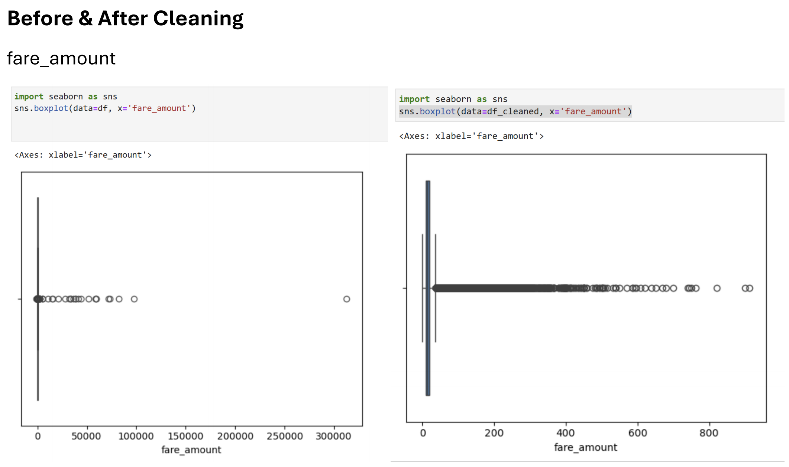
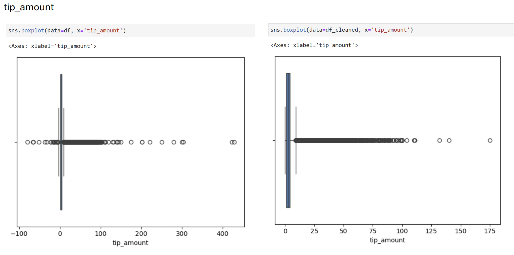
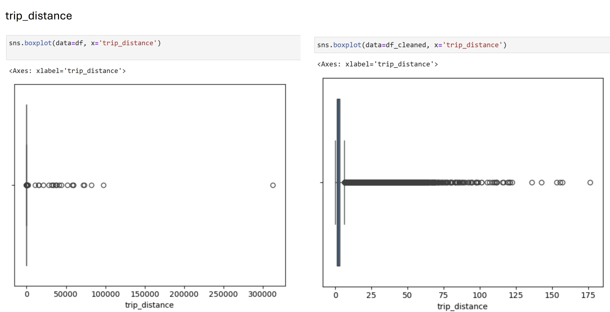

## Data Overview  

Each parquet file contains ~19 columns and around 2.9 million records per month.  
Some columns include missing values (e.g., passenger_count, RatecodeID).  

Data quality issues handled:  
- Missing values addressed during data cleaning.  
- Outliers (e.g., negative fares or extreme trip distances) treated as well.  

## Drop Unnecessary Columns

```
columns_to_drop = [
    'tpep_dropoff_datetime',
    'store_and_fwd_flag',
    'mta_tax',
    'extra',
    'tolls_amount',
    'improvement_surcharge',
    'Airport_fee'
]
df_cleaned = df.drop(columns=columns_to_drop)
```

## Remove Null Values & Outliers
```
df_cleaned = df_cleaned.dropna()

df_cleaned = df_cleaned[
    (df_cleaned['fare_amount'] > 0) & (df_cleaned['fare_amount'] < 1000) &
    (df_cleaned['trip_distance'] > 0) & (df_cleaned['trip_distance'] < 200) &
    (df_cleaned['tip_amount'] >= 0) & (df_cleaned['tip_amount'] < 200)
]
```

## Save to Google Cloud Storage (Parquet)
```
from google.cloud import storage
from io import BytesIO

buffer = BytesIO()
df_cleaned.to_parquet(buffer, index=False)
buffer.seek(0)

bucket_name = 'my-bigdata-project-yuna'
destination_blob_name = 'cleaned/yellow_tripdata_2023-1_cleaned.parquet'

client = storage.Client()
bucket = client.bucket(bucket_name)
blob = bucket.blob(destination_blob_name)
blob.upload_from_file(buffer, content_type='application/octet-stream')

print(f"File uploaded to gs://{bucket_name}/{destination_blob_name}")
```

## Data Cleaning Visualizations

### Fare Amount Before & After Cleaning


### Tip Amount Before & After Cleaning


### Trip Distance Before & After Cleaning

