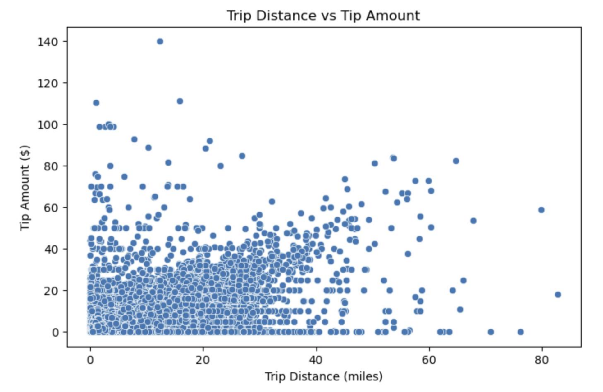
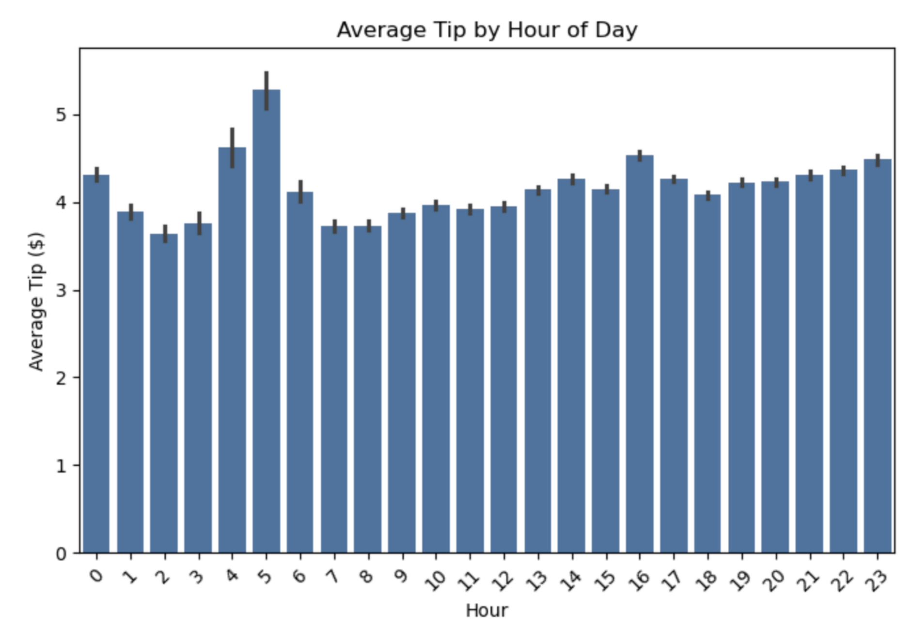
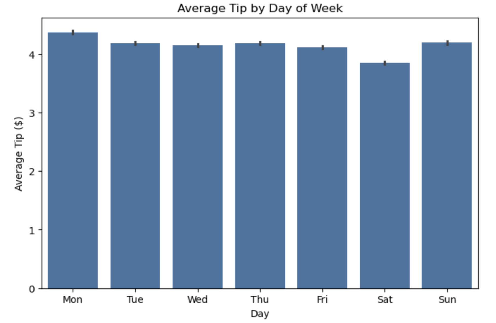
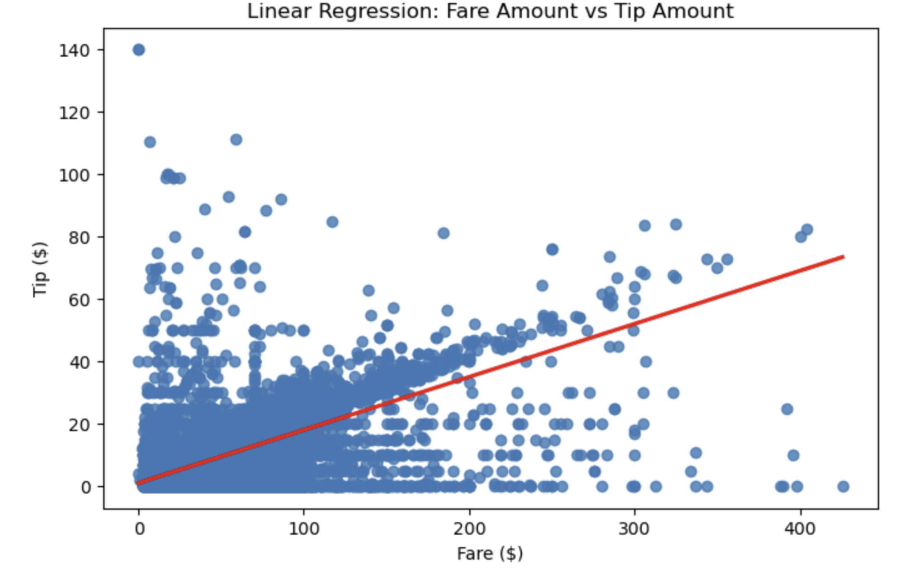
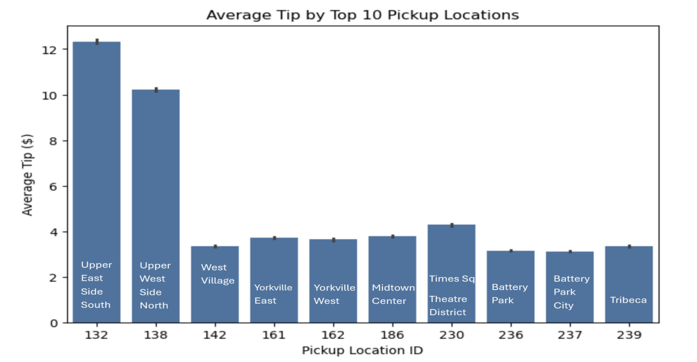
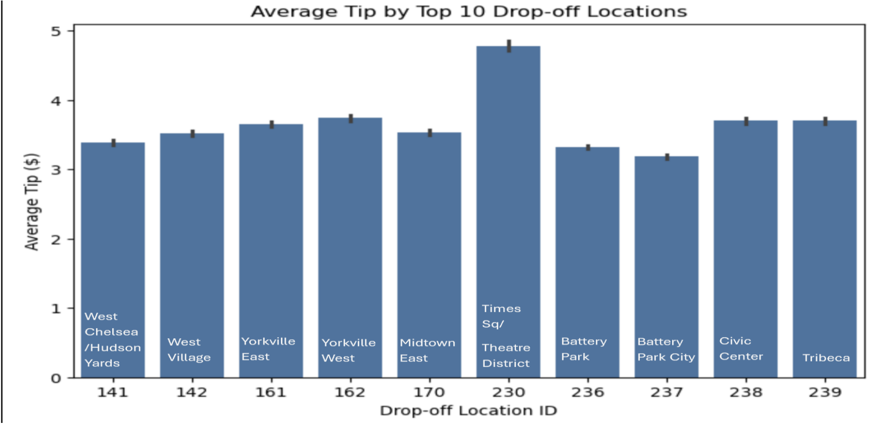

## The following visualizations are included:

1. Trip Distance vs Tip Amount – Scatterplot to observe if longer trips lead to higher tips.

2. Average Tip by Hour of Day – Barplot to show tipping behavior at different times.

3. Average Tip by Day of Week – Barplot to capture weekday vs. weekend tipping patterns.

4. Fare vs Tip with Regression Line – Linear relationship check between fares and tips.

5. Average Tip by Top 10 Pickup Locations – Hotspot analysis for high-tipping pickup areas.

6. Average Tip by Top 10 Drop-off Locations – Hotspot analysis for drop-off areas.


```
# Start SparkSession
from pyspark.sql import SparkSession

spark = SparkSession.builder \
    .appName("TaxiVisualizations") \
    .getOrCreate()

# Load the full_features Parquet data from the trusted folder
df = spark.read.parquet("gs://my-bigdata-project-yuna/trusted/full_features/")
df.show(5)

# Take 1% sample and convert to Pandas for visualizations
df_sample = df.sample(False, 0.01, seed=42)
pdf = df_sample.select(
    "trip_distance", "fare_amount", "tip_amount", "pickup_hour", "pickup_dayofweek"
).toPandas()

import seaborn as sns
import matplotlib.pyplot as plt

# 1. Trip Distance vs Tip Amount
plt.figure(figsize=(8, 5))
sns.scatterplot(data=pdf, x="trip_distance", y="tip_amount")
plt.title("Trip Distance vs Tip Amount")
plt.xlabel("Trip Distance (miles)")
plt.ylabel("Tip Amount ($)")
plt.show()
```



```
# 2. Average Tip by Hour
plt.figure(figsize=(8, 5))
sns.barplot(data=pdf, x="pickup_hour", y="tip_amount", estimator="mean")
plt.title("Average Tip by Hour of Day")
plt.xlabel("Hour")
plt.ylabel("Average Tip ($)")
plt.xticks(rotation=45)
plt.show()
```


```
# 3. Average Tip by Day of Week
days = ['Sun', 'Mon', 'Tue', 'Wed', 'Thu', 'Fri', 'Sat']
pdf['pickup_dayofweek'] = pdf['pickup_dayofweek'].astype(int)

plt.figure(figsize=(8, 5))
sns.barplot(
    data=pdf,
    x=pdf['pickup_dayofweek'].map(dict(enumerate(days, 1))),
    y="tip_amount",
    estimator="mean"
)
plt.title("Average Tip by Day of Week")
plt.xlabel("Day")
plt.ylabel("Average Tip ($)")
plt.show()
```


```
# 4. Linear Regression – Fare vs Tip
plt.figure(figsize=(8, 5))
sns.regplot(data=pdf, x="fare_amount", y="tip_amount", line_kws={"color": "red"})
plt.title("Linear Regression: Fare Amount vs Tip Amount")
plt.xlabel("Fare ($)")
plt.ylabel("Tip ($)")
plt.show()
```


```
# 5. Top 10 Pickup Locations – Average Tip
df_sample = df.sample(False, 0.01, seed=42)
location_pdf = df_sample.select("PULocationID", "DOLocationID", "tip_amount").toPandas()

top_pu = location_pdf['PULocationID'].value_counts().head(10).index
pickup_df = location_pdf[location_pdf['PULocationID'].isin(top_pu)]

plt.figure(figsize=(8, 5))
sns.barplot(data=pickup_df, x="PULocationID", y="tip_amount", estimator='mean')
plt.title("Average Tip by Top 10 Pickup Locations")
plt.xlabel("Pickup Location ID")
plt.ylabel("Average Tip ($)")
plt.show()
```


```
# 6. Top 10 Drop-off Locations – Average Tip
top_do = location_pdf['DOLocationID'].value_counts().head(10).index
dropoff_df = location_pdf[location_pdf['DOLocationID'].isin(top_do)]

plt.figure(figsize=(8, 5))
sns.barplot(data=dropoff_df, x="DOLocationID", y="tip_amount", estimator='mean')
plt.title("Average Tip by Top 10 Drop-off Locations")
plt.xlabel("Drop-off Location ID")
plt.ylabel("Average Tip ($)")
plt.show()
```

